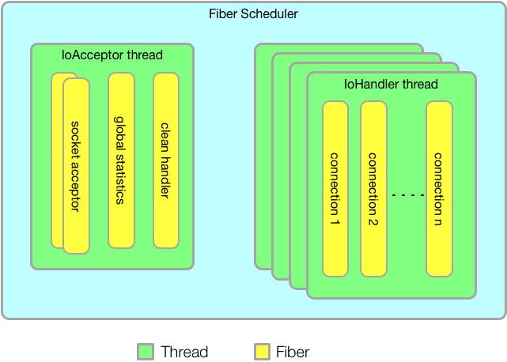
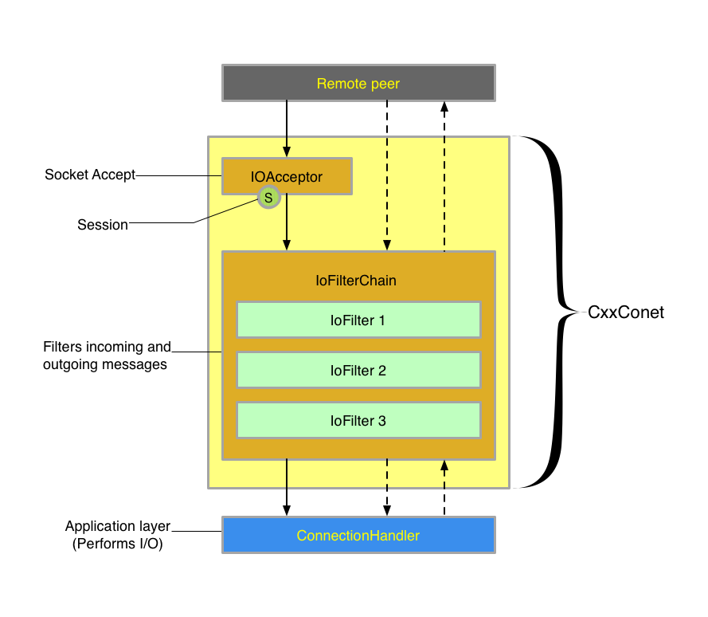

# CxxConet

##基于协程的C++网络开发框架.

### 目录
  - [特点](#特点)
  - [协程模型](#协程模型)
  - [通信流程](#通信流程)
  - [示例](#示例)
  - [性能](#性能)
  - [依赖](#依赖)
  - [Support](#support)

####特点
* 跨平台：同时支持Linux32/64、OSX64两个平台，支持C++11及以上；
* 易开发：同步的方式编写代码，支持类Mina的filter过滤链、简单而不失强大；
* 高性能：可同时处理海量连接，框架无锁设计，性能超群；
* 多特性：代码同步调用方式、支持网络过载保护、支持空闲连接自动清理等企业级特性；

####协程模型
   在整个CxxConet框架中，共有4种工作协程：  
* Socket接入协程(socket acceptor)  
* 全局指标统计协程(global statistics)  
* Socket清理协程(clean handler)  
* I/O处理协程(connection handler)  



> Socket接入协程：负责accept新的client连接，然后创建`I/O处理协程`并将client连接交由该协程去处理上层事务；

> 全局指标统计协程：定期汇总各协程的统计指标，无锁实现全局汇总数据；

> Socket清理协程：定期清理Idle连接，防止资源耗尽；

> I/O处理协程：每个Client连接独立一个处理协程，包括读写及上层事务处理；

> Socket接入协程、全局指标统计协程、Socket清理协程共享同一个线程，I/O处理协程则位于其他独立线程。

####通信流程


> IoAcceptor：这个接口在一个协程上负责套接字的建立；

> IoFilter：    这个接口定义一组拦截器，这些拦截器可以包括日志输出、黑名单过滤、数据的编码（write 方向）与解码（read 方向）等功能；

> ConnectionHandler：这个接口负责编写业务逻辑，也就是接收、发送数据的地方。

####示例
  `c++:`

  ```
  #include "ENaf.hh"
  
  static sp<ELogger> logger = ELoggerManager::getLogger("testnaf");

  static void onListening(NSocketAcceptor* acceptor) {
    logger->trace("onListening...");

    while (!acceptor->isDisposed()) {
      sleep(10);

      NIoServiceStatistics* ss = acceptor->getStatistics();
      logger->trace_("ReadBytes=%ld", ss->getReadBytes());
      logger->trace_("WrittenBytes=%ld", ss->getWrittenBytes());
    }

    logger->trace("Out of Listening.");
  }

  static void onConnection(NSocketSession* session) {
    logger->trace("onConnection...");

    sp<NIoBuffer> request;
    while(!session->getService()->isDisposed()) {
      try {
        request = dynamic_pointer_cast<NIoBuffer>(session->read());
      } catch (ESocketTimeoutException& e) {
        logger->trace("session read timeout.");
        continue;
      } catch (EIOException& e) {
        logger->trace("session read error.");
        break;
      }
      if (request == null) {
        logger->trace("session client closed.");
        break;
      }

      // echo.
      session->write(request);
    }

    logger->trace("Out of Connection.");
  }
  
  int main(int argc, const char **argv) {
    // CxxJDK init.
    ESystem::init(argc, argv);
    // CxxLog4j init.
    ELoggerManager::init("log4e.conf");

    NSocketAcceptor sa;
    NBlacklistFilter blf;
    blf.block("localhost");
    sa.getFilterChainBuilder()->addFirst("black", &blf);
    sa.setListeningHandler(onListening);
    sa.setConnectionHandler(onConnection);
    sa.setMaxConnections(1000000);
    sa.setSoTimeout(3000);
    sa.setSessionIdleTime(NIdleStatus::WRITER_IDLE, 30);
    sa.bind("0.0.0.0", 8888);
    sa.listen();

    ESystem::exit(0);

    return 0;
  }
  
  ```

更多示例：  
[testnaf.cpp](test/testnaf.cpp)  

####性能

`测试程序:`

见示例c++代码：[benchmark.cpp](test/benchmark.cpp)；

`软件环境:`

```
# cat /etc/redhat-release 
CentOS release 6.4 (Final)
# uname -a
Linux cxxjava 2.6.32-358.el6.x86_64 #1 SMP Fri Feb 22 00:31:26 UTC 2013 x86_64 x86_64 x86_64 GNU/Linux
```


`硬件环境：`

```
型号名称：	R6240-12
处理器名称：	Intel Xeon E5606
处理器速度：	2.13GHz
处理器数目：	4
核总数：	8
```
`测试结果：`

```
# ab -c 20 -n 50000  http://localhost:8888/
This is ApacheBench, Version 2.3 <$Revision: 655654 $>
Copyright 1996 Adam Twiss, Zeus Technology Ltd, http://www.zeustech.net/
Licensed to The Apache Software Foundation, http://www.apache.org/

Benchmarking localhost (be patient)
Completed 5000 requests
Completed 10000 requests
Completed 15000 requests
Completed 20000 requests
Completed 25000 requests
Completed 30000 requests
Completed 35000 requests
Completed 40000 requests
Completed 45000 requests
Completed 50000 requests
Finished 50000 requests


Server Software:        
Server Hostname:        localhost
Server Port:            8888

Document Path:          /
Document Length:        3 bytes

Concurrency Level:      20
Time taken for tests:   4.077 seconds
Complete requests:      50000
Failed requests:        0
Write errors:           0
Total transferred:      2050328 bytes
HTML transferred:       150024 bytes
Requests per second:    12264.64 [#/sec] (mean)
Time per request:       1.631 [ms] (mean)
Time per request:       0.082 [ms] (mean, across all concurrent requests)
Transfer rate:          491.14 [Kbytes/sec] received

Connection Times (ms)
              min  mean[+/-sd] median   max
Connect:        0    1   0.1      1       4
Processing:     0    1   0.3      1      16
Waiting:        0    1   0.3      1      16
Total:          0    2   0.3      2      17

Percentage of the requests served within a certain time (ms)
  50%      2
  66%      2
  75%      2
  80%      2
  90%      2
  95%      2
  98%      2
  99%      2
 100%     17 (longest request)
```

####依赖
1. [CxxJDK](https://github.com/cxxjava/CxxJDK)
2. [CxxFiber](https://github.com/cxxjava/CxxFiber)
3. [CxxLog4j](https://github.com/cxxjava/CxxLog4j)


####Support
Email: [cxxjava@163.com](mailto:cxxjava@163.com)

